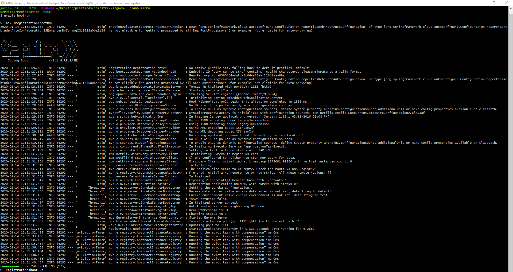
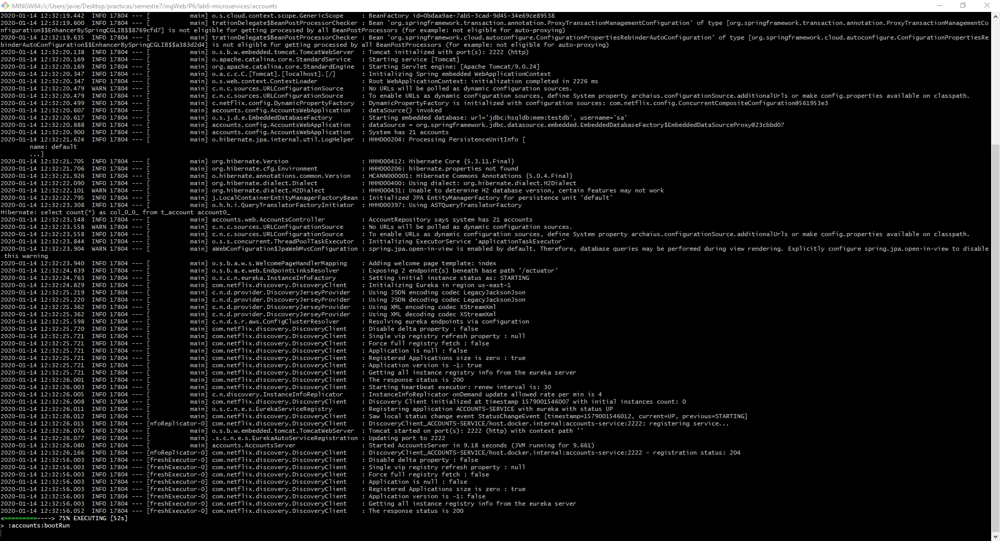
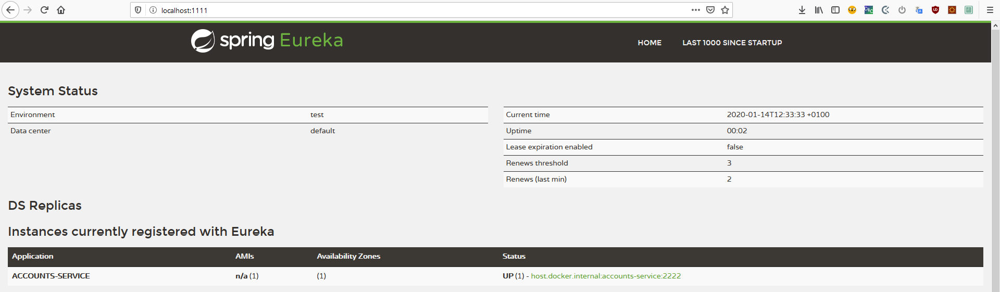
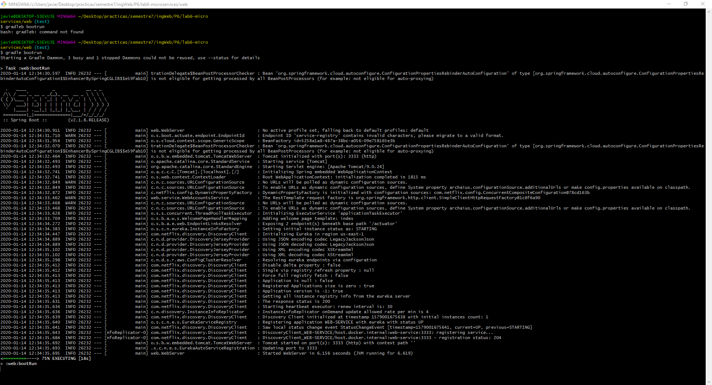
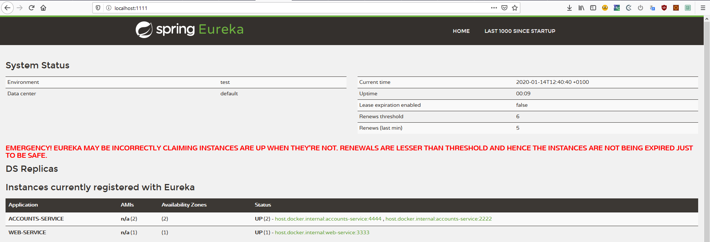
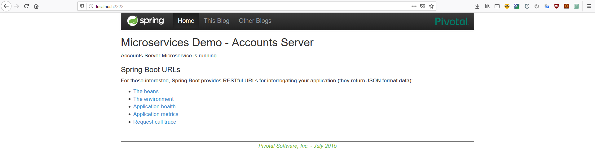

# Lab 6 Microservices: Report

## 1. Registration Server (Eureka)

* First is launched the registration server Eureka.



* Eureka service is running on port 1111 without microservices registered.


## 2. Launching Accounts Microservice

* The service is launched and registered in Eureka.



* Eureka log:

```
2020-01-14 12:32:25.505  INFO 24292 --- [a-EvictionTimer] c.n.e.registry.AbstractInstanceRegistry  : Running the evict task with compensationTime 0ms
2020-01-14 12:32:26.164  INFO 24292 --- [nio-1111-exec-2] c.n.e.registry.AbstractInstanceRegistry  : Registered instance ACCOUNTS-SERVICE/host.docker.internal:accounts-service:2222 with status UP (replication=false)
2020-01-14 12:32:26.506  INFO 24292 --- [a-EvictionTimer] c.n.e.registry.AbstractInstanceRegistry  : Running the evict task with compensationTime 0ms
```

* Eureka dashboard have one service registered.



## 3. Launching Web microservice

* The service is launched and registered in Eureka



* Eureka log:
```
2020-01-14 12:34:32.618  INFO 24292 --- [a-EvictionTimer] c.n.e.registry.AbstractInstanceRegistry  : Running the evict task with compensationTime 0ms
2020-01-14 12:34:35.681  INFO 24292 --- [nio-1111-exec-8] c.n.e.registry.AbstractInstanceRegistry  : Registered instance WEB-SERVICE/host.docker.internal:web-service:3333 with status UP (replication=false)
2020-01-14 12:34:37.623  INFO 24292 --- [a-EvictionTimer] c.n.e.registry.AbstractInstanceRegistry  : Running the evict task with compensationTime 0ms

```

* Eureka dashboard have now two service registered.


## 4. Launch a second accounts microservice on port 4444

In order to launch a new Account microservice on port 4444, the port (2222) in `accounts/resources/application.yml` is changed.

* The second instance of Account is launched:


* Eureka logs

```
2020-01-14 12:39:41.895  INFO 24292 --- [a-EvictionTimer] c.n.e.registry.AbstractInstanceRegistry  : Running the evict task with compensationTime 0ms
2020-01-14 12:39:45.385  INFO 24292 --- [io-1111-exec-10] c.n.e.registry.AbstractInstanceRegistry  : Registered instance ACCOUNTS-SERVICE/host.docker.internal:accounts-service:4444 with status UP (replication=false)
2020-01-14 12:39:47.901  INFO 24292 --- [a-EvictionTimer] c.n.e.registry.AbstractInstanceRegistry  : Running the evict task with compensationTime 0ms

```

* Eureka dashboard have now three service registered.



## 4. Killing the accounts microservice on port 2222

After killing the first account micrsoervice, the microservice is still accessible because the microservice on 4444 is a recplica despite the microservice no longer appears in the
Eureka's Dashboard.



* Eureka logs

```
2020-01-14 12:41:30.988  INFO 24292 --- [a-EvictionTimer] c.n.e.registry.AbstractInstanceRegistry  : Running the evict task with compensationTime 0ms
2020-01-14 12:41:31.317  WARN 24292 --- [eerNodesUpdater] c.n.eureka.cluster.PeerEurekaNodes       : The replica size seems to be empty. Check the route 53 DNS Registry
2020-01-14 12:41:31.988  INFO 24292 --- [a-EvictionTimer] c.n.e.registry.AbstractInstanceRegistry  : Running the evict task with compensationTime 0ms
```